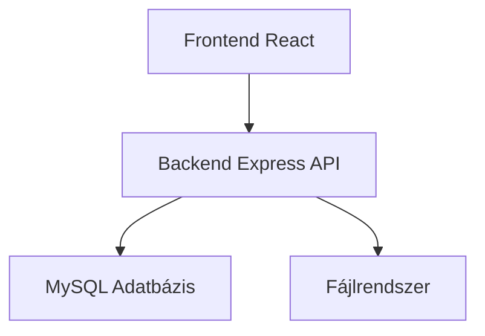
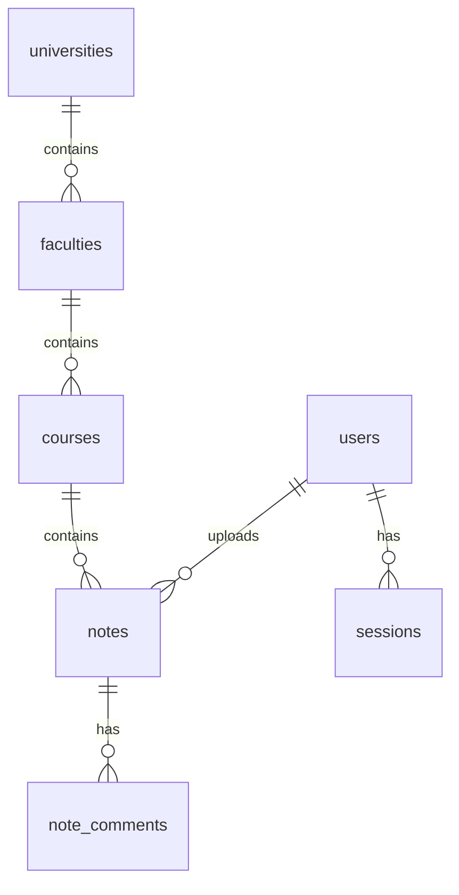

# StudyHub – Egyetemi jegyzetmegosztó platform

## Bevezetés

A StudyHub egy webes alkalmazás, amely lehetővé teszi egyetemisták számára, hogy különböző tárgyakból származó jegyzeteiket megosszák egymással. A platform kurzusokra, karokra és egyetemekre tagolt szerkezetben kínál böngészést, feltöltést és letöltést. Célja, hogy segítse a tanulást és az információcserét a hallgatók között.

## Főbb funkciók

- **Felhasználó kezelés**: Regisztráció, bejelentkezés, profil szerkesztés
- **Egyetemek, karok, kurzusok hierarchia**: Böngészés egyetemek és karok szerint, kurzusok részleteinek megtekintése
- **Jegyzetkezelés**: Jegyzetek feltöltése (PDF, kép stb.), szerkesztése, törlése, letöltése
- **Keresés**: Kurzusok és jegyzetek keresése név vagy leírás alapján
- **Fájlfeltöltés**: Támogatja a különböző formátumú mellékletek feltöltését
- **Reszponzív felület**: Modern, React alapú frontend, amely minden eszközön jól működik

## Technológiai verem

### Backend

- **Node.js** – szerveroldali környezet
- **Express** – webes keretrendszer
- **TypeScript** – típusos JavaScript
- **MySQL** – relációs adatbázis
- **Multer** – fájlfeltöltés kezelése
- **bcrypt** – jelszavak hashelése
- **cookie-parser** – session kezelés
- **Winston** – naplózás

### Frontend

- **React** – felhasználói felület könyvtár
- **TypeScript** – típusos JavaScript
- **Vite** – build eszköz és fejlesztői szerver
- **React Router** – oldal navigáció
- **Axios** – HTTP kliens
- **React Hook Form + Yup** – űrlapkezelés és validáció
- **React Toastify** – értesítések
- **React Loader Spinner** – betöltésjelzők

### Egyéb eszközök

- **phpMyAdmin** (vagy más MySQL kliensek) – adatbázis kezelés
- **Git** – verziókezelés

## Architektúra



A felhasználói felület (React) a backend API-val kommunikál, amely a MySQL adatbázisban tárolja a strukturált adatokat, valamint a fájlrendszerben a feltöltött dokumentumokat.

## Telepítés és futtatás

A projekt két fő részből áll: backend (API) és frontend (React alkalmazás). Az alábbi lépések segítenek a helyi fejlesztői környezet beállításában.

### Előfeltételek

- **Node.js** (verzió 18 vagy újabb)
- **MySQL** (verzió 8.0 vagy újabb)
- **Git** (a projekt klónozásához)

### 1. Adatbázis beállítás

1. Indítsd el a MySQL szervert (pl. XAMPP, vagy szolgáltatásként).
2. Hozz létre egy új adatbázist `studyhub` néven:
   ```sql
   CREATE DATABASE studyhub;
   ```
3. Importáld a séma és a mintaadatok a `studyhub.sql` fájlból:
   ```bash
   mysql -u root -p studyhub < studyhub.sql
   ```
   (A jelszót a rendszer kérni fogja.)

### 2. Backend (API) telepítése

1. Lépj be az `api` mappába:
   ```bash
   cd api
   ```
2. Másold az `.env.example` fájlt `.env` névre (ha nincs, hozd létre). A meglévő `.env` fájl már tartalmazza a szükséges változókat:
   ```
   MYSQL_HOST=localhost
   MYSQL_USER=root
   MYSQL_PASS=
   MYSQL_DB=studyhub
   MYSQL_PORT=3306
   APP_URL=http://localhost:5173
   PORT=2004
   ```
   (A jelszót állítsd be, ha a MySQL‑nek van.)
3. Telepítsd a függőségeket:
   ```bash
   npm install
   ```
4. Indítsd el a fejlesztői szervert:
   ```bash
   npm run dev
   ```
   Az API a `http://localhost:2004` címen fog futni, és a logokban megjelenik a sikeres indítás.

### 3. Frontend (React) telepítése

1. Nyiss egy új terminált, és lépj az `app` mappába:
   ```bash
   cd app
   ```
2. Ellenőrizd, hogy az `.env` fájl létezik (már létezik, de ha nem, másold az `.env.example`‑t). Tartalma:
   ```
   VITE_API_URL=http://localhost:2004/api/
   VITE_APP_URL=http://localhost:5173/
   ```
3. Telepítsd a függőségeket:
   ```bash
   npm install
   ```
4. Indítsd el a fejlesztői szervert:
   ```bash
   npm run dev
   ```
   A böngészőben a `http://localhost:5173` címen nyílik meg az alkalmazás.

### 4. Ellenőrzés

- Nyisd meg a böngésződet a `http://localhost:5173` címen.
- Regisztrálj egy új felhasználót, vagy jelentkezz be a mintaadatok egyikével (pl. felhasználónév: `szabi`, jelszó: `123456` – a jelszó a hash miatt nem fog működni, de a mintaadatokban minden jelszó `123456`).
- Böngéssz az egyetemek, karok és kurzusok között.
- Tölts fel egy jegyzetet egy kurzus alá.

## Használati útmutató

### Regisztráció

1. Kattints a „Regisztráció” linkre a bejelentkezési oldalon.
2. Töltsd ki az űrlapot (felhasználónév, e‑mail, jelszó).
3. Sikeres regisztráció után automatikusan bejelentkezel, és a kezdőoldalra kerülsz.

### Bejelentkezés

1. Add meg a felhasználóneved és jelszavad a bejelentkezési űrlapon.
2. A „Bejelentkezés” gombra kattintva a rendszer átirányít a kezdőoldalra.

### Kurzusok böngészése

1. A főoldalon vagy a „Kurzusok” menüpont alatt láthatod az összes egyetemet.
2. Válassz ki egy egyetemet, majd a hozzá tartozó kart.
3. A kar oldalán listázódnak a kurzusok. Kattints egy kurzus nevére a részletek megtekintéséhez.

### Jegyzetek kezelése

#### Jegyzet feltöltése

1. Egy kurzus részletek oldalán kattints a „Új jegyzet” gombra.
2. Add meg a jegyzet címét, leírását, és válassz ki egy fájlt (pl. PDF).
3. A feltöltés után a jegyzet megjelenik a kurzus jegyzetlistájában.

#### Jegyzet szerkesztése/törlése

1. A saját feltöltött jegyzeteknél megjelenik a „Szerkesztés” és „Törlés” gomb.
2. Szerkesztés esetén módosíthatod a címet, leírást vagy a fájlt.
3. Törlés esetén a jegyzet véglegesen törlődik.

### Profil beállítások

1. Kattints a jobb felső sarokban lévő avatarodra, majd a „Beállítások” menüpontra.
2. Itt megváltoztathatod a felhasználóneved, e‑mail címed, vagy feltölthetsz új avatart.

## Adatbázis séma

Az adatbázis a következő táblákat tartalmazza:

- `users` – felhasználói adatok
- `universities` – egyetemek
- `faculties` – karok (egyetemekhez kapcsolódnak)
- `courses` – kurzusok (karokhoz kapcsolódnak)
- `notes` – jegyzetek (kurzusokhoz és felhasználókhoz kapcsolódnak)
- `sessions` – bejelentkezett session‑ek
- `note_comments` – jegyzethez fűzött hozzászólások (opcionális)

A táblák közötti kapcsolatok:



A teljes séma és a mintaadatok a `studyhub.sql` fájlban találhatók.

## API végpontok – összefoglalás

Az API alap URL‑je: `http://localhost:2004/api`

| Metódus          | Útvonal              | Leírás                                     |
| ---------------- | -------------------- | ------------------------------------------ |
| POST             | `/auth/register`     | Regisztráció                               |
| POST             | `/auth/login`        | Bejelentkezés                              |
| POST             | `/auth/authenticate` | Session ellenőrzés                         |
| GET              | `/users`             | Felhasználók listája                       |
| PUT              | `/users/:id`         | Felhasználó adatainak módosítása           |
| GET              | `/universities`      | Egyetemek listája                          |
| GET              | `/faculties`         | Karok listája                              |
| GET              | `/courses`           | Kurzusok listája                           |
| GET              | `/courses/:id/notes` | Kurzushoz tartozó jegyzetek                |
| POST             | `/courses/:id/notes` | Új jegyzet feltöltése                      |
| GET              | `/notes`             | Összes jegyzet                             |
| GET, PUT, DELETE | `/notes/:id`         | Jegyzet lekérdezése, szerkesztése, törlése |
| POST             | `/files/upload`      | Fájlfeltöltés                              |
| GET              | `/avatars/:filename` | Avatar kép lekérése                        |

Részletesebb dokumentációhoz lásd a forráskódban az egyes route fájlokat.
